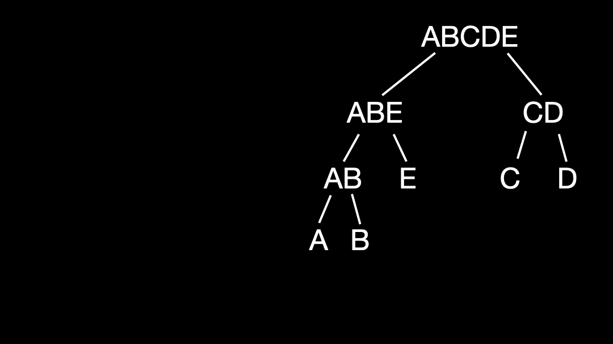

Copy code
# merkle-zeppelin
A Merkle Tree library aligned with OpenZeppelin's implementation standards.

### What's the purpose of Merkle Tree

By storing just one value, the server can confirm whether a specific value belongs to a previously constructed tree.<br>
The server needs to store only the root hash of the tree.<br>
Requests must include the value to be verified along with a list of hashes specific to that value—known as proofs.<br>
This algorithm is particularly valuable when saving storage space is more important than computational power.

### How the Tree is Constructed
The animation demonstrates the algorithm constructing a tree for proof verification or calculation. The letters at the bottom represent a list of items stored in the program's memory.


Note that dividing the number of each node in the final tree by 2 (without remainder) identifies its parent node. The `None` placeholder ensures the first element is indexed at 1, not 0, maintaining this parent-child relationship.

Each element, represented by one or more letters, is a hashed value. For instance, given `a, ..., e`, we have `A = hash(a), ..., E = hash(e)`, where `AB = hash(A + B) = hash(hash(a) + hash(b))`, and so on.

This library allows selection of the hash function, with `keccak256` set as the default to match the [OpenZeppelin implementation](https://github.com/OpenZeppelin/merkle-tree).

### Collecting Proofs
Consider the example below:



To collect proofs for a specific value, locate the leaf containing the hash of that value. Collect the sibling's value, move up to the parent node, and repeat until you reach the root.

The proofs are the sibling values collected on this path.

**Note**
- To find a sibling's node number, use `current_node_number ^ 1`.
- To find a parent's node number, use `current_node_number // 2`.

### Verifying Proofs

To verify proofs, you only need the root value. For example:
```python
value = b
proofs = [A, E, CD]
```
1. Hash the value `b` to get `B`.
2. Combine `B` with the first proof and hash result: `hash(A + B) = AB`.
3. Combine `AB` with the second proof and hash result: `hash(AB + E) = ABE`.
4. Combine `ABE` with the third proof and hash result: `hash(ABE + CD) = ABECD`, which is the *calculated root*.
5. If the *calculated root* matches the stored root value, it confirms that the value `b` is part of the tree.
